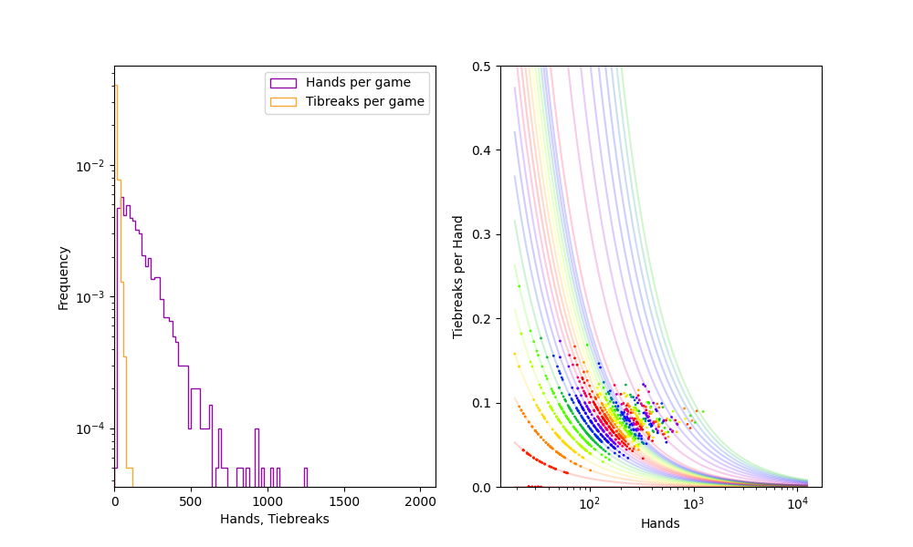

# War
> A Python package that simulates the War card game

It is what you think it is.  It simulates the card game War.  I wrote it as an exercise in building a package, as well as a way to analyze the game.  For instance, what is the average length of a game of War?  Is there a relationship between the number of hands played and the number of tie-breakers (yes).  

## Installation

For now, `War` is in development.  Best to install it that way.

```sh
git clone git@github.com:cameronabrams/War.git
cd War
pip install -e .
```

## Usage example

The only really intersting thing to do with this program is to play a large number of simulated games and analyze statistical outcomes.  Currently, the `War.Game()` method returns a tuple `(nHands,nTiebreaks)` containing the number of hands played in that game, and the number of tiebreaks, respectively.  In the `__main__` block of `war.py`, there is an example of how to use this information:
```python
    N=100000
    HandsPerGame=[]
    TiebreaksPerGame=[]
    w=War()
    bar=pyprind.ProgBar(N)
    for i in range(N):
        h,t=w.Play()
        bar.update()
        HandsPerGame.append(h)
        TiebreaksPerGame.append(t)
    plot_war_stats(HandsPerGame,TiebreaksPerGame)
```
`plot_war_stats()` is in the local `stats.py` module, and it makes a pair of plots like this:



On the left are histograms of the number of hands and number of tiebreaks per game on a semilog plot.  It appears both follow a power-law distribution, which is interesting in part because it means there can be _very_ long games.  On the right is a plot of the number of tiebreaks per game vs. the number of hands per game.  Clearly, this data falls into sets that each correspond to 0, 1, 2, 3, ... tiebreaks out of the total games played, since each lies on a very clear a/x curve.  I don't know if this is interesting or not.  What is interesting is how the longer a game is the more likely it is that tiebreaks comprise about 10% of all hands.  This of course makes sense because there is a roughly 3/26 chance in general that any hand will require a tiebreak, assuming an average of 26 cards in each player's hand.

## Release History

* 0.0.1
    * Initial version

## Meta

Cameron F. Abrams – cfa22@drexel.edu

Distributed under the MIT license. See ``LICENSE`` for more information.

[https://github.com/cameronabrams](https://github.com/cameronabrams/)

## Contributing

1. Fork it (<https://github.com/cameronabrams/War/fork>)
2. Create your feature branch (`git checkout -b feature/fooBar`)
3. Commit your changes (`git commit -am 'Add some fooBar'`)
4. Push to the branch (`git push origin feature/fooBar`)
5. Create a new Pull Request
